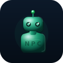
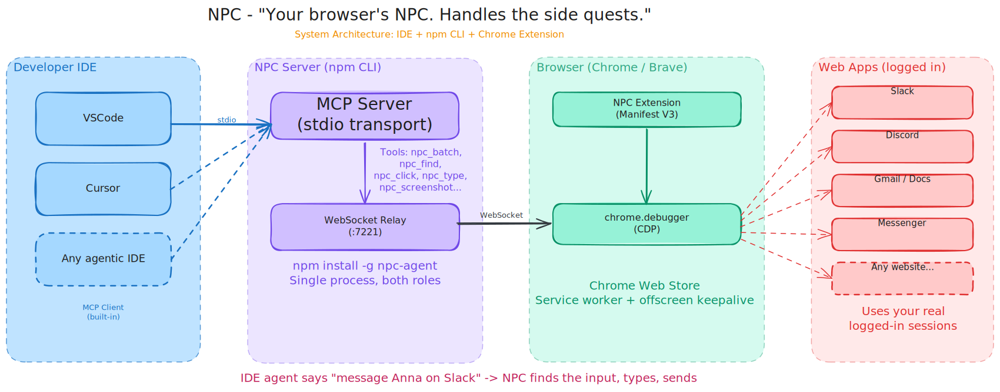

<p align="center">
  
</p>

<h1 align="center">NPC</h1>

<p align="center">
  <em>Your browser's NPC. Handles the side quests.</em><br />
  <em>Control your real browser from any IDE - no context switching.</em>
</p>

<p align="center">
  <a href="https://github.com/freyzo/npc"></a>
  <a href="https://www.npmjs.com/package/npc-agent"></a>
</p>

```bash
npm i -g npc-agent
```

---

## What it does

Your IDE agent says what to do ("message Tim on Slack"). NPC does it in your real, logged-in browser. No API keys per service, no OAuth, no bot accounts. Works with any MCP IDE - Cursor, VS Code, Windsurf.

| You want to | Your IDE says |
| --- | --- |
| Message someone on Slack | "go to slack and message #general: deploy is done" |
| Reply on Messenger | "open messenger and reply to Tim: sounds good" |
| Check Gmail | "take a screenshot of my gmail inbox" |
| Fill out a form | "find the email field, click it, type my address, press Tab" |
| Do it all in one shot | use `npc_batch` with an array of actions |

---

## Setup

1. Install: `npm i -g npc-agent`
2. Load the extension: `chrome://extensions` > Developer mode > Load unpacked > select `npc-cli/extension/`
3. Add to `.cursor/mcp.json` or `.vscode/mcp.json`:

```json
{
  "mcpServers": {
    "npc": {
      "command": "node",
      "args": ["/path/to/npc/npc-cli/dist/index.js"]
    }
  }
}
```

Click the NPC icon on any tab. Green badge means connected.

---

## How it works

<p align="center">
  
</p>

```
IDE (Cursor / VS Code)       NPC Server              Browser
 |                            |                       |
 |--- MCP stdio ------------->|                       |
 |    "click Send button"     |--- WebSocket :7221 -->|
 |                            |                       |--- CDP (chrome.debugger)
 |                            |                       |--- clicks in real tab
 |                            |<-- result ------------|
 |<-- tool response ----------|                       |
```

The IDE handles reasoning. NPC just executes browser actions via Chrome DevTools Protocol. No LLM inside NPC.

---

## MCP tools

| Tool | What it does |
| --- | --- |
| `npc_screenshot` | Capture tab as PNG |
| `npc_navigate` | Go to a URL |
| `npc_click` | Click at (x, y) |
| `npc_type` | Type text into focused element |
| `npc_press_key` | Press Enter, Tab, Escape, arrows |
| `npc_scroll` | Scroll up/down/left/right |
| `npc_find` | Find element by CSS selector or text, returns (x, y) center |
| `npc_batch` | Run multiple actions in one call |
| `npc_evaluate` | Run JavaScript in page context |
| `npc_extract_text` | Get all text from the page |
| `npc_extract_html` | Get full page HTML |
| `npc_current_url` | Get current tab URL |
| `npc_page_title` | Get current tab title |

### Batch example

One MCP call instead of four:

```json
[
  {"action": "find", "selector": "Message Tim"},
  {"action": "click", "x": 450, "y": 320},
  {"action": "type", "text": "hey, deploy is done"},
  {"action": "key", "key": "Enter"}
]
```

---

## Limitations

Chrome and Brave only (uses `chrome.debugger` API). One active tab at a time per extension instance. Cannot attach to `chrome://`, `brave://`, or extension pages. Screenshot coordinates are at device pixel ratio - divide by DPR before clicking on HiDPI displays.

Requires Node.js >= 18.

---

## Contact

<p align="center">
  <a href="https://x.com/freyazou"></a>
  &nbsp;
  <a href="https://github.com/freyzo/npc"></a>
  &nbsp;
  <a href="https://www.linkedin.com/in/freya-zou-068615252/"></a>
  <br /><br />
  <a href="https://www.youtube.com/channel/UC9pdMpmZ6ZNAakfcZSxaJXQ"></a>
  &nbsp;
  <a href="https://freyazou.com"></a>
  &nbsp;
  <a href="https://www.npmjs.com/package/npc-agent"></a>
</p>
